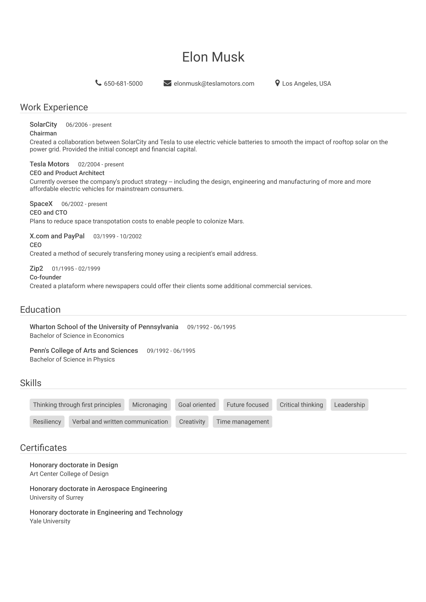

CV Generator
============

Usage
-----

1. Install the dependencies:
```
npm install
```

2. Edit the `src/data.json` file

3. Run the command to generate the CV:
```
gulp
```

4. Open the generated file `cv.html` in your browser.


Example
-------

Here is an example of a generated CV:


